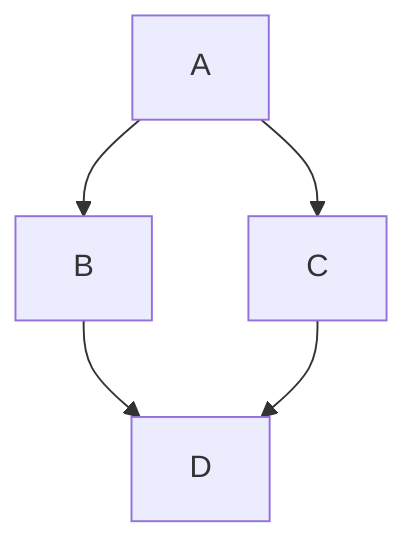

# 使用Valaxy搭建个人博客

## 🎯 为什么选择Valaxy？

Valaxy是一个基于Vue 3和Vite的静态站点生成器，专为构建快速且内容驱动的博客网站而设计。选择Valaxy的原因：

- **现代化技术栈**: 基于Vue 3和Vite，性能优秀
- **丰富的主题**: 支持多种主题，包括Oceanus、Yun等
- **Markdown支持**: 完整的Markdown语法支持
- **易于定制**: 高度可定制化，满足个性化需求
- **部署简单**: 支持多种部署平台

## 🚀 快速开始

### 1. 环境准备

```bash
# 确保Node.js版本 >= 16
node --version

# 安装pnpm
npm install -g pnpm
```

### 2. 创建项目

```bash
# 使用create-valaxy创建项目
pnpm create valaxy my-blog

# 进入项目目录
cd my-blog

# 安装依赖
pnpm install
```

### 3. 启动开发服务器

```bash
pnpm run dev
```

访问 `http://localhost:4859/` 查看效果。

## 📝 配置说明

### 站点配置 (site.config.ts)

```typescript
import { defineSiteConfig } from 'valaxy'

export default defineSiteConfig({
  lang: 'zh-CN',
  title: 'ZeroHour',
  url: 'https://zerohour.github.io/',
  author: {
    name: 'ZeroHour',
    avatar: '/avatar.jpg',
  },
  social: [
    {
      name: 'GitHub',
      link: 'https://github.com/ZeroHour-Z',
      icon: 'i-ri-github-line',
    },
  ],
})
```

### 主题配置 (valaxy.config.ts)

```typescript
import type { ThemeConfig } from 'valaxy-theme-oceanus'
import { defineConfig } from 'valaxy'

export default defineConfig<ThemeConfig>({
  theme: 'oceanus',
  themeConfig: {
    navTitle: 'ZeroHour',
    nav: [
      { text: '主页', link: '/' },
      { text: '博客', link: '/posts' },
      { text: '分类', link: '/categories' },
      { text: '标签', link: '/tags' },
      { text: '关于', link: '/about' },
    ],
  },
})
```

## 📁 项目结构

```
my-blog/
├── pages/           # 页面文件
│   ├── posts/       # 博客文章
│   ├── about.md     # 关于页面
│   └── index.md     # 主页
├── public/          # 静态资源
├── valaxy.config.ts # Valaxy 配置
└── site.config.ts   # 站点配置
```

## ✨ 特色功能

### 1. 代码高亮

Valaxy使用Shiki进行代码高亮，支持多种编程语言：

```javascript
// 这是一个JavaScript代码示例
function hello() {
  console.log('Hello, Valaxy!')
}
```

### 2. 数学公式

支持KaTeX渲染数学公式：

$$
E = mc^2
$$

### 3. 图表支持

支持Mermaid图表：



### 4. 搜索功能

内置搜索功能，方便访客查找内容。

## 🎨 主题定制

### 自定义样式

在 `styles/` 目录下创建自定义样式：

```scss
// styles/index.scss
:root {
  --va-c-primary: #3eaf7c;
  --va-c-text: #2c3e50;
}
```

### 自定义组件

在 `components/` 目录下创建Vue组件：

```vue
<!-- components/MyComponent.vue -->
<template>
  <div class="my-component">
    <h3>{{ title }}</h3>
    <p>{{ content }}</p>
  </div>
</template>

<script setup>
defineProps({
  title: String,
  content: String,
})
</script>
```

## 📦 部署

### GitHub Pages

1. 推送代码到GitHub
2. 在仓库设置中启用GitHub Pages
3. 选择部署分支为 `gh-pages`

### Vercel

1. 连接GitHub仓库到Vercel
2. 自动部署，无需额外配置

### Netlify

1. 连接GitHub仓库到Netlify
2. 构建命令：`pnpm run build`
3. 发布目录：`dist`

## 🎯 总结

Valaxy是一个优秀的静态博客生成器，具有以下优势：

- **开发体验好**: 热重载、TypeScript支持
- **性能优秀**: 基于Vite构建，加载速度快
- **功能丰富**: 支持多种Markdown扩展
- **易于部署**: 支持多种部署平台
- **社区活跃**: 持续更新和维护

如果你正在寻找一个现代化的博客解决方案，Valaxy绝对是一个不错的选择！

---

*"技术改变世界，博客记录生活。"*

*—— ZeroHour* 