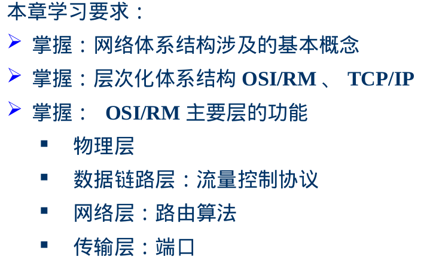
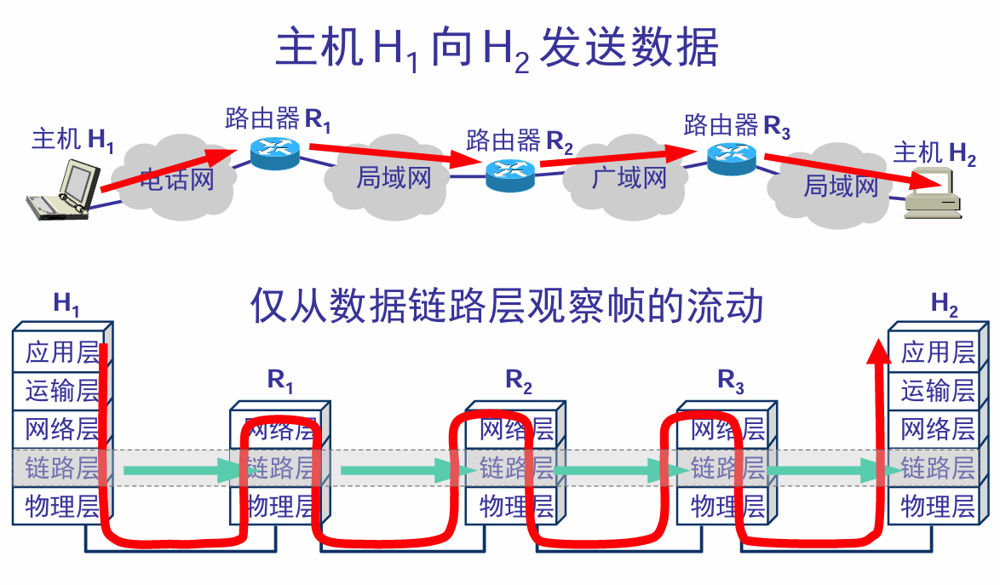
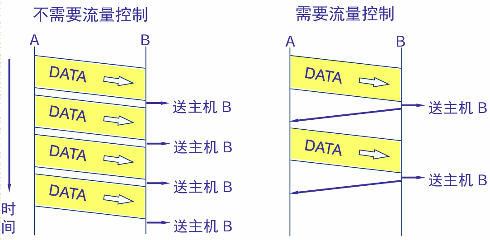
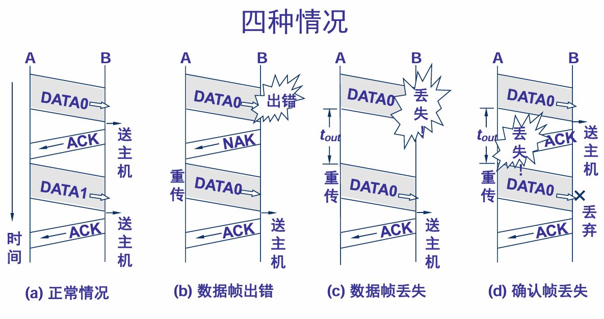
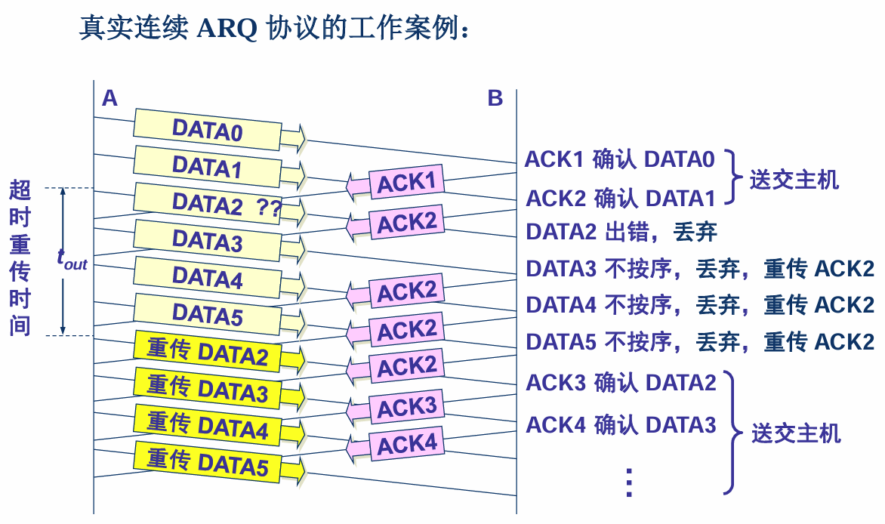
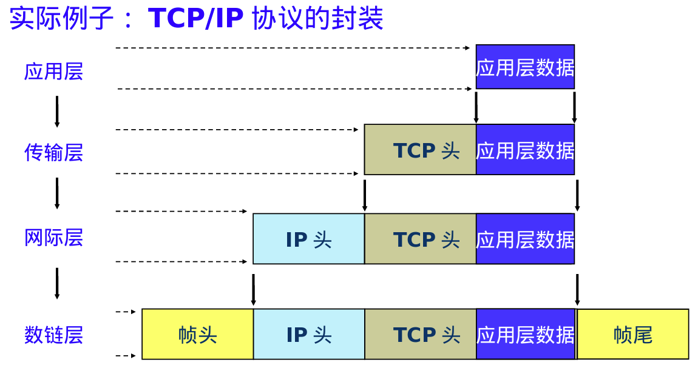

# 第 3 章 计算机网络体系结构

## 3.0 学习要求

> OSI/RM 协议 服务 接口 层 服务访问点 PDU

## 3.1 网络体系结构

### 1. 定义

- 网络体系：为了完成计算机间的通信合作，把每个计算机**互联的功能**划分成定义明确的层次，规定了**同层次间的通信协议**及**相邻层之间的接口及服务**
- 网络体系结构：网络体系中同层进程间的通信协议和相邻层接口及服务的统称

### 2. 网络体系结构的发展

- ARPANET
- SNA
- OSI/RM

### 3. 层次结构方法包括三个内容

分层及每层功能、服务与层间接口、协议

### 4. OSI/RM 分层结构的基本概念

1. 层：系统的**逻辑划分**，代表**功能**上相对独立的一个**子系统**

2. 对等层：**不同**系统的**相同**层次

3. 实体：某一层中具有**数据收发能力**的活动单元，一般指该层的**软件进程**和**实现该层协议的硬件单元**

4. 对等实体：**不同**系统的**相同**层次中的两个实体

   ==协议作用在对等实体之间==

5. 通信协议：为了保证通信双方能**正确**而**自动**地进行通信而制定的一套**规则**、**约定**、**标准**

6. 服务：**某一层及其以下各层**的一种**能力**，通过**接口**提供给相邻的上层

7. 接口：相邻两层之间**交互的界面**，定义相邻两层之间的**操作**及下层对上层的**服务**

   <u>计算机网络的通信方式——对等通信</u>

   <u>对等通信的实质——对等实体之间虚拟通信</u>

## 3.2 开放系统互联参考模型

1. 开放系统
   - 开放：
     - 所遵循的**标准是开放的**（任何人都可以参照）
     - **遵循标准开发**的计算机系统是开放的（可以和任何地方的任意计算机系统进行通信）
   - 开放系统：
     - **遵循互联标准协议**的实系统（传送和处理信息的自治整体）
2. OSI/RM 七层模型
   - 应用层
   - 表示层
   - 会话层
   - 传输层
   - 网络层
   - 数据链路层
   - 物理层
3. 通信协议
   - 定义：为了保证通信双方能**正确**而**自动**地进行通信而制定的一套**规则**、**约定**、**标准**
   - 特点：**层次性，可靠性，有效性**
   - 要素：语义，语法，时序
4. 服务
   - 定义：本层向上邻层提供的功能
   - 服务访问点（SAP）：上层实体可以访问下层实体**提供的服务的地方**（位于接口上）
   - 服务分类：
     1. 面向连接服务：建立连接，数据传输，拆除连接
     2. 无连接的服务：每个传送单元（报文，数据报）带有完整的目的地址
   - 服务原语：提供层服务的具有**原子特征的语句**（原子指不允许中断）
     - 功能：本层利用服务原语通知下邻层要做什么，下邻层利用服务原语通知本层已做了什么
     - *服务原语是层服务被引用的工具*
     - 服务原语定义了相邻层之间的接口

## 3.3 OSI 各层概述

### 1. 物理层

目的：提供与通信介质的链接，向上层提供位信息的正确传送

### 2. 数据链路层

- 目的：在**相邻网络实体间**建立和释放数据链路连接

- PDU：帧

- 主要协议：以太网协议

- 重要设备：网桥、交换机

- 功能和服务：**物理地址寻址、数据的成帧、流量控制、数据的检错、重发**

  - 数据链路连接的建立和拆除

    - 无连接、无应答
    - 无连接、有应答
    - 面向连接的服务

  - 构成数据链路数据单元（PDU）

  - 数据链路连接的分裂——多链路规程（MLP）

    为提高传输速率，将一条物理链路上传输的数据改用多条物理连接来传输

  - 定界与同步（帧接受）

    在接受的 bit 流中，识别出数据链路层 PDU 的开始和结束，以及PDU中的每个字段，以便实现正确的接受和控制

  - 顺序和流量控制
    - 顺序控制功能控制 PDU 按顺序在相邻节点之间传输
    - 流量控制功能用来保持 PDU 的发送和接受的速率匹配
  - 差错控制（检错和恢复）

- **停止等待 ARQ **协议（实现**流量控制**、**差错控制**）（使用与**链路层 - 应用层**）

  1. 理想数据传输：

     

  2. 带流量控制的数据传输对比：

     

  3. 实际的数据传输停等协议：

     

     有超时计时器，重传时间略大于“从发完数据帧到收到确认帧的平均时间”

     由于每发送一个数据帧就停止等待，帧的编号使用一位编号就行（01循环）

  4. 停等协议算法：==todo==

     发送节点：

- 连续 ARQ 

  

  **滑动窗口**：发送窗口 *W~S~*，接收窗口 *W~R~*

  - 只有在接收窗口向前滑动时（与此同时也发送了确认），发送窗口才有可能向前滑动
  - 收发两端的窗口按照以上规律不断地向前滑动，因此连续 ARQ 协议又称为滑动窗口协议
  - 停等协议实际上是滑动窗口协议的特例
  - 发送窗口**最大值**：（***W~S~* + *W~R~* ≤ 2^n^**）
    - n 个 bit 用来编号，编号总数 2^n^，接收窗口大小为 1，***W~S~* ≤ 2^n^ - 1**

- 选择 ARQ（*W~R~* ＞ 1）

  - *W~R~* ≤ *W~S~*，则 *W~R~* ≤ 2^n-1^

### 3. 网络层

*端到端数据传输最底层*

*通信子网的最高层*

数据报，虚电路

- 路由选择算法

  1. 最短路 Dijkstra 算法

     静态路由算法

  2. 扩散法——洪泛、选择洪泛

     静态路由算法

  3. 链路状态路由算法

     五大步骤：

     1. 发现邻居节点，并学习他们的网络地址
     2. 测量线路开销：测量到每个邻居节点的开销
     3. 创建链路状态分组：将所学习到的内容封装成一个分组
     4. 发布链路状态分组：将链路状态分组洪泛发送给所有其他路由器
     5. 计算到每个其他路由器的最短路

## 3.4 TCP/IP 体系结构

| 应用层                        | HTTP，DNS，FTP，SMTP |                |
| ----------------------------- | -------------------- | -------------- |
| 传输层                        | TCP，UDP             | 报文/段        |
| 网际层/网络层                 | IP                   | IP 数据报/分组 |
| 网络接口层/数据链路层和物理层 | 以太网，令牌环网     |                |

