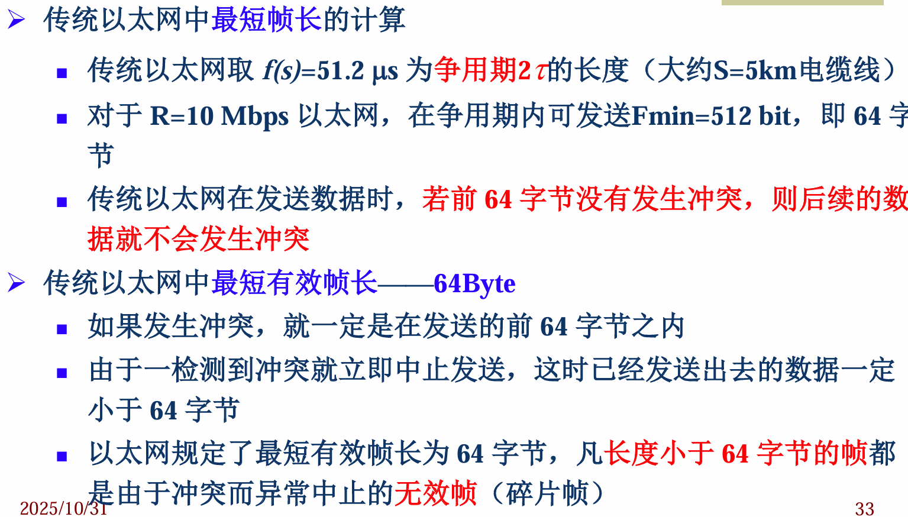
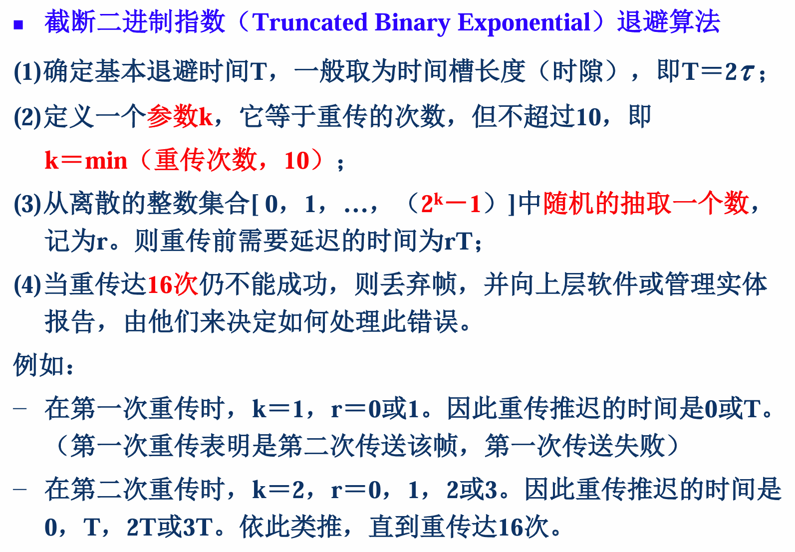
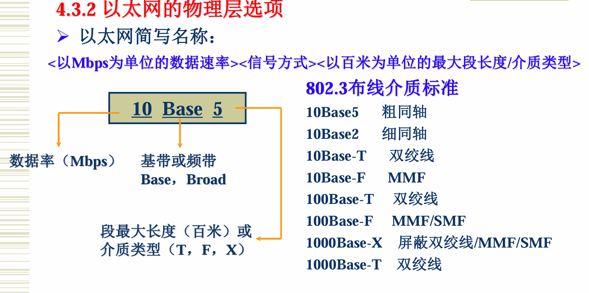
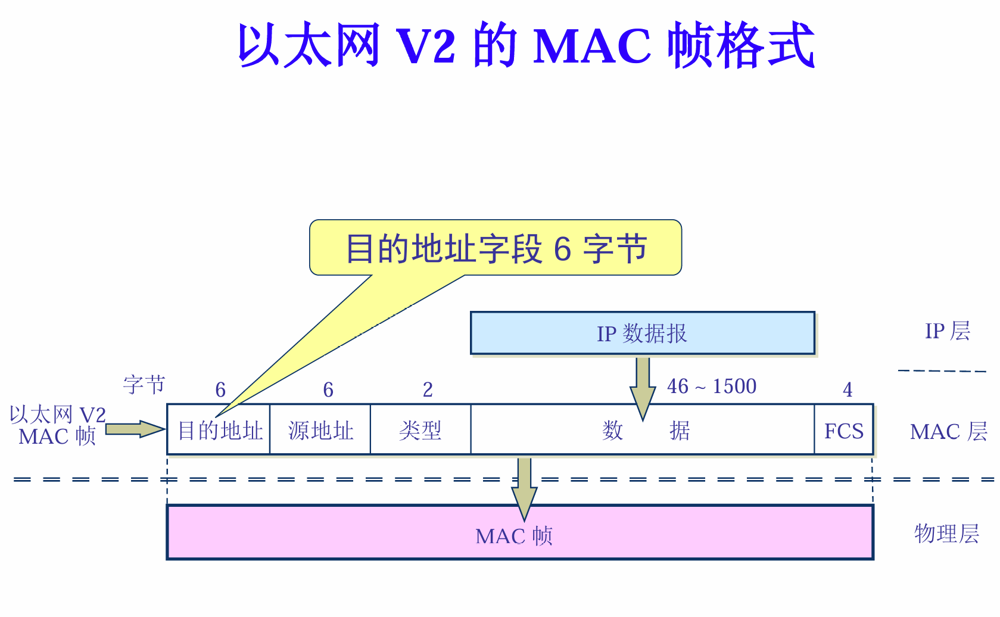
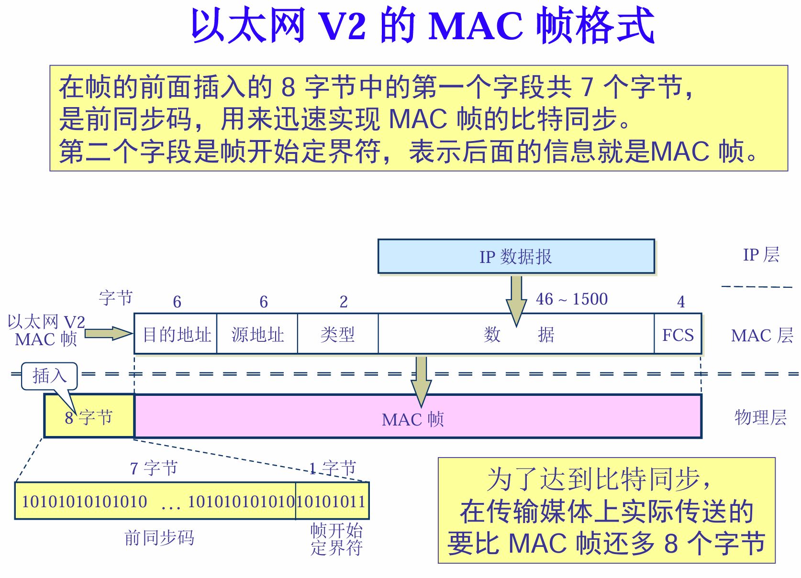

# 第 4 章 计算机局域网络

## 4.0 学习要求

## 4.1 局域网概述

### 1. 局域网的基本概念

定义：

局域网是在一个较小的范围，利用通信线路将众多计算机（一般为微机）及外设连接起来，达到数据通信及资源共享目的的一种网络

特点：

- 覆盖范围小
- 高传输速率
- 低误码率
- 星形，环形，总线，树形
- 为一个单位所拥有，自行建设，不对外提供服务
- 双绞线，同轴电缆，光纤，无线

### 2. 局域网的关键技术

- 拓扑结构：星形，环形，总线，树形
- 数据传输形式：基带，频带
- 介质访问控制方法：（信道共享方法）
  - CSMA/CD：冲突检测的载波侦听多路访问
  - CSMA/CA：冲突避免的载波侦听多路访问
  - TOKEN PASSING：令牌环网

### 3. 体系结构：

1. IEEE 802 标准：

   描述物理层和数据链路层的功能及与网络层的接口服务

   - 物理层功能：
     1. 位流的发送/接受
     2. 前导码
     3. 信号的编码/译码
   - 具体规定了信号的编码/译码、拓朴结构、传输媒体和速率
     1. 曼彻斯特，差分曼彻斯特

## 4.2 介质访问控制方法

**点到点传播**——广域网

**广播信道**——局域网

**解决信道争用问题的协议称为介质访问控制协议 MAC** 是数据链路层的一部分

- 载波侦听：发送信息前，检测信道的空闲状态
- 冲突检测：发送信息中，检测是否发生冲突
- 多路访问：多结点（工作站）访问同一媒体（共享信道），或者多结点从同一媒体接收信息
- 多路访问协议：控制多个用户共用一条信道的协议

**静态方式**：通过多条链路（增加系统带宽）来实现信道共享

**动态方式**：在一条链路上，通过协议的设计（冲突规避算法） 来实现信道共享

### 1. CSMA/CD

CSMA：讲前先听

一个站要发信息时先侦听总线，若介质空闲，则可发送；若介质忙则**等待**

**坚持退避算法（等待一段时间）：**

1. 非坚持型 CSMA

   等待一段随机时间开始发送，不坚持侦听

2. 1-坚持型 CSMA

   侦听直到信道空闲再发送

3. p-坚持型 CSMA

   空闲时以概率 p 发送数据，以概率 1-p 延迟一个时间单位（最大传播延迟）

   **N×p<1**（N 为介质忙时，要发送数据的站点数）

CSMA/CD：讲前先听，边讲边听，冲突停发，强化冲突，随机重发

## 4.3 传统以太网

MAC 地址 6 字节（48位）

类型字段用来标志上一层使用的是什么协议， 以便把收到的MAC 帧的数据上交给上一层的这个协议

