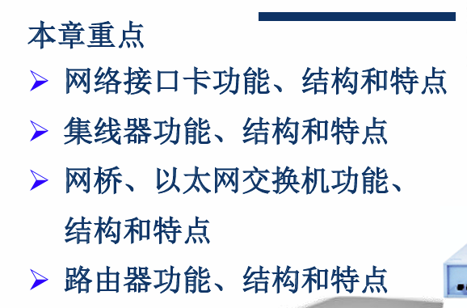
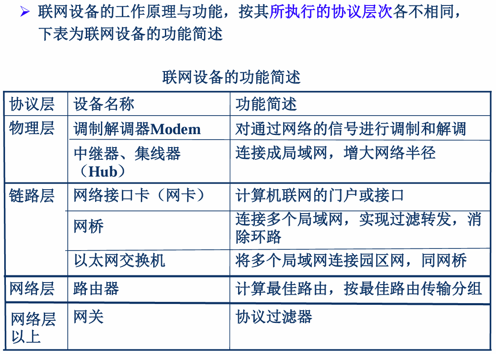
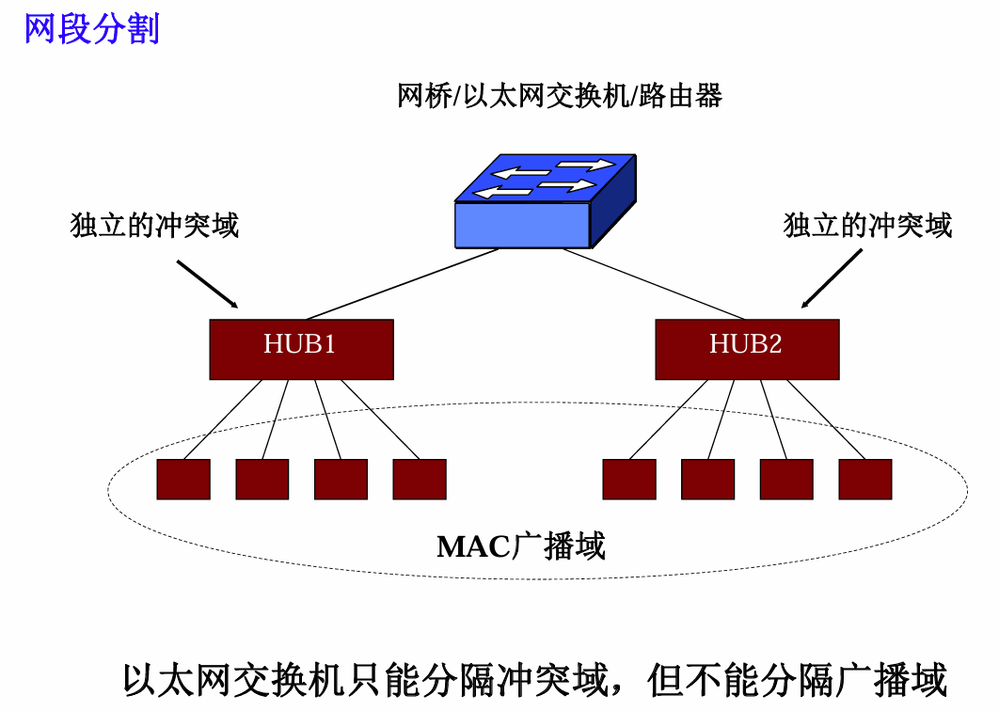
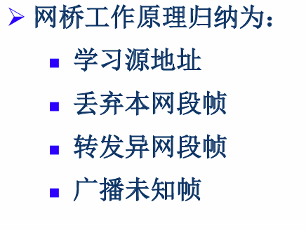
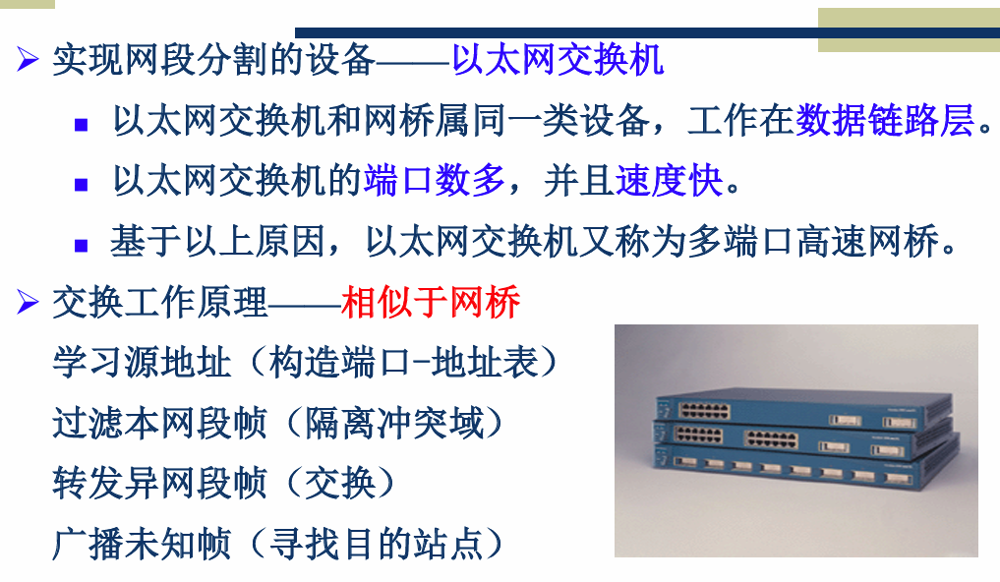

# 第 6 章 网络设备

## 6.0 学习要求

## 6.1 网卡

网络接口卡/网卡/网络适配器

### 1. 功能

- 数据缓存
- 帧的封装和解封装
- 介质访问控制
- 串并转换
- 数据编码/解码
- 数据发送/接收

### 2. 以太网网卡的结构

- 发送接收部件
- 载波检测
- 发送接收控制部件及缓冲区
- 曼彻斯特编码译码器
- LAN 管理部件
- CPU（部分有）
- 总线接口

### 3. 配置参数

- 网卡 MAC 地址
- 中断请求信号 IRQ（缺省为 3）
- I/O 端口地址（I/O 基地址，I/O Base）
- 存储器基地址

## 6.2 中继器

**物理层设备**

### 1. 功能

对它所连接的任意电缆段上的数字信号进行放大和整型，然后发到另一电缆段上

### 2. 特性

- 不对信息进行存储或其他处理，延迟小
- 不具备检查错误和纠正错误的功能
- 不对网络上传输的结构化信息（封装的，帧，分组）进行任何形式的过滤
- *不能够连接不同的数据链路层协议的局域网*，比如以太网和令牌环网

**中继器主要应用于同轴电缆，可以用来连接不同类型的介质（例如将同轴电缆和双绞线连接，可称为介质转换器）**

**中继器应用于同轴电缆时，要注意：**

- 用中继器连接的以太网不能形成环
- 遵守 MAC 协议定时特性，即不能用中继器无限扩展以太网的距离，因为 CSMA 机制限制了总长度

## 6.3 集线器

**对网络进行集中管理的最小单元**

**本质上是一个多端口中继器**

**物理层设备**

### 1. 功能

把某个端口上收到的信号放大整型后通过其他**所有端口**发出去

构成网络冲突域

绝大多数集线器都是以双绞线为连接介质的

## 6.4 冲突域和广播域

- 冲突域：由网络连接起来的这样一组计算机的集合，当其中任意两台计算机同时发送数据时，发送的数据就会产生冲突
- 广播域：一组由网络连接起来的计算机的集合，如果组中某一台计算机发送了一个广播帧，那么该广播帧就会被组中的其他所有计算机接收
- 一个冲突域一定是一个广播域，而一个广播域不一定是冲突域
- 冲突域属于物理层概念
- 广播域属于链路层概念，因为广播帧是由特定的目的 MAC 地址来定义的

## 6.5 网桥

- 工作在数据链路层的 MAC 子层
- 监听流经它的数据帧
- **存储转发**，有缓存，有转发表
- 执行 CSMA/CD
- 没有网卡，不改变转发的帧的源地址

### 1. 原理

### 6.6 以太网交换机（两层交换机）——多端口高速网桥

## 6.7 路由器

工作在网络层（或 TCP/IP 模型的网际层）上

路由器是根据网络号（网络地址）来转发分组数据单元的， 所以路由表中存放的是目的网络号

**两种特定转发：**

- 路由器也有它的缺省网关，用来传送不知道往哪儿送的 IP 分组
- 主机专用路径：在特定的环境下用于管理和维护互联网的目的，为专门的主机指定路径

### 1. 功能

为经过路由器的每个**数据分组**选择一条最佳传输路径，并在网络之间**转发**网络分组

### 2. 结构

- 输入端口：输入端口对线路上收到的分组进行处理
  - 在物理层上进行 bit 的接收
  - 在数据链路层上首先按照链路层协议接收传送分组的帧
  - 对帧进行解封装，取出网络层分组
  - 将分组传送到网络层的队列中排队等待处理
- 交换结构
  - 共享总线
  - 交叉开关
  - 共享存储器
- 输出端口：将交换结构传送来的分组发送到线路
  - 将交换结构传送来的分组先进行缓存
  - 数据链路层处理模块将分组加上链路层的首部和尾部封装成帧
  - 最后交给物理层后发送到外部线路
- 路由处理器
  - 维护路由表
  - 实现路由协议
  - 运行对路由器进行配置和管理的软件
