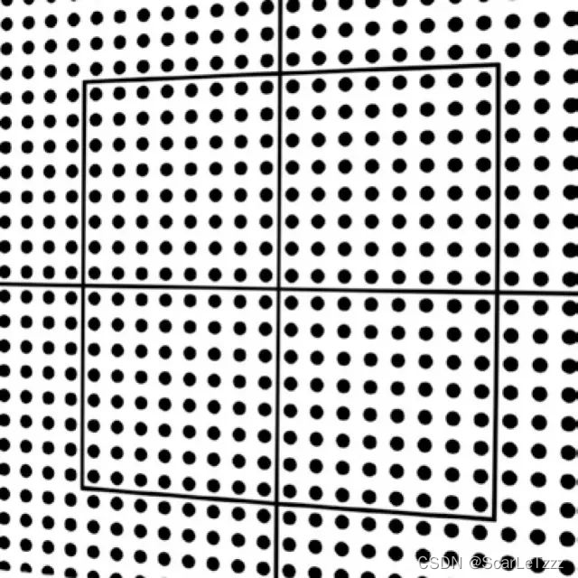
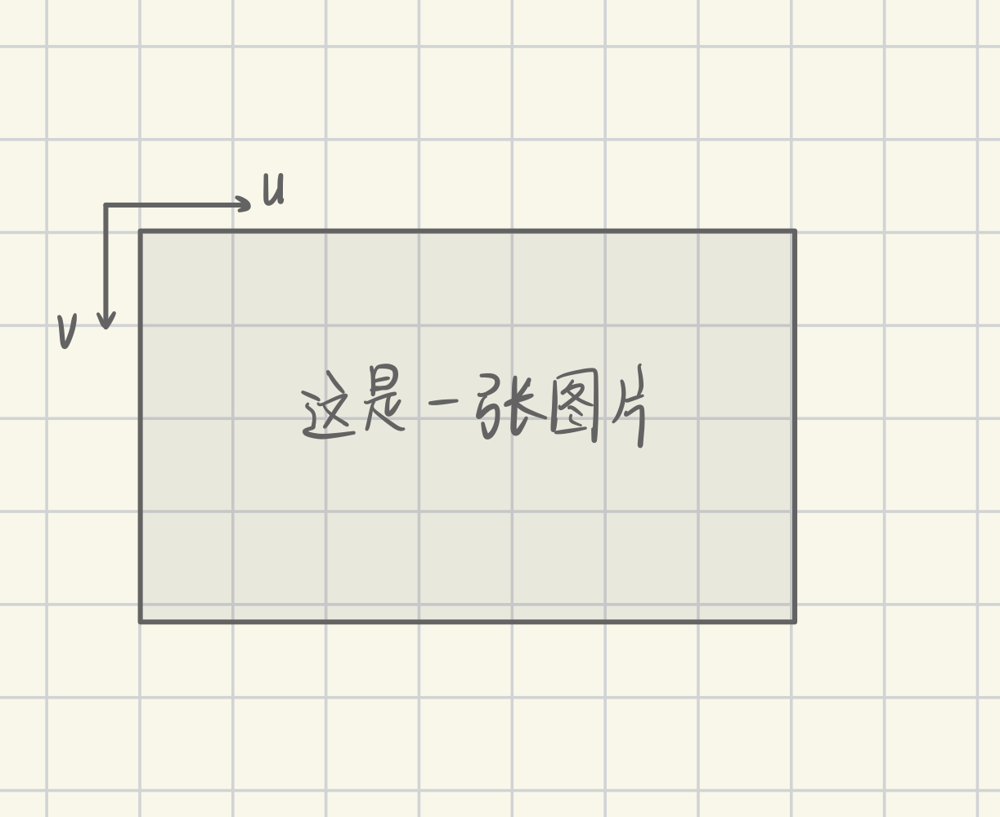

# RM Vision 5

## 读取图片

- 视频
- 相机

## 相机模型

> 相机成像，就是将世界坐标系中的坐标点映射到二维像素平面

1. 小孔成像模型如图：

2. 畸变：

（1）径向畸变：

> 穿过透镜中心的光线不产生畸变，而穿过透镜边缘的光线会导致畸变

（2）切向畸变：

> 透镜与图像平面不平行

3. 像素坐标系如图：

## 相机标定

> 获得内参矩阵和畸变系数

使用 MATLAB 的工具箱
照片可以连接相机后用 MVS 拍

## PnP原理：Perspective-n-Point

> 求 R 和 t
> R：旋转矩阵
> t：平移向量

**已知：**

像素坐标系下角点坐标（可以通过内参矩阵 *K* 转换为相机坐标系下角点坐标）
装甲板坐标系下角点坐标：小装甲板长135cm 宽56cm

内参矩阵（可标定得到）：

$$
K = \begin{bmatrix}
f_x & 0 & c_x \\
0 & f_y & c_y \\
0 & 0 & 1
\end{bmatrix}
$$

畸变系数（可标定得到）：

$$
D = [k_1, k_2, p_1, p_2, k_3]
$$

**坐标变换：**

如下图所示，完成了像素坐标系到相机坐标系的转换

推导如图：

## Model

经验来看 mlp LeNet ResNet 都可完成任务

我讲的烂，推荐大家去看[《动手学习深度学习》](https://zh.d2l.ai/)
对应第四章，第六章，第七章

## 大作业内容

**分为四个level：**
1. 支持调用本地视频和相机实时取流，完成稳定识别装甲板
2. 完成pnp结算，求出装甲板的在相机坐标系下的坐标
3. 训练模型，检测装甲板数字，提高装甲板的识别精度
4. 使用ROS2实现上述功能

**验收标准：**
1. 线下验收
2. 至少完成level1
3. 代码清晰，结构合理

**提交内容：**
1. 代码，不包含编译内容
2. 文档和视频，展示效果

本文档部分图片参考：https://blog.csdn.net/qq_40918859/article/details/122271381