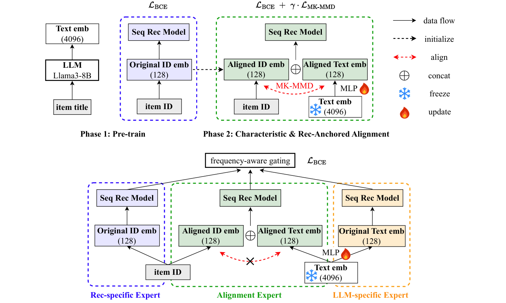
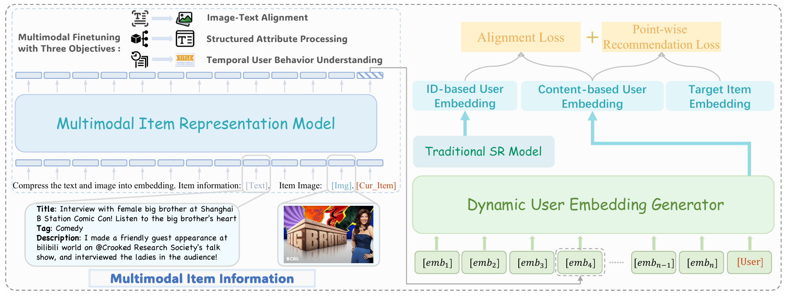
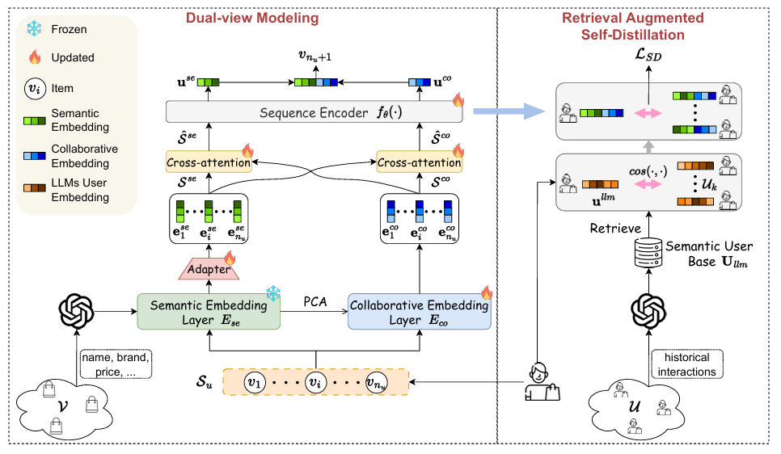
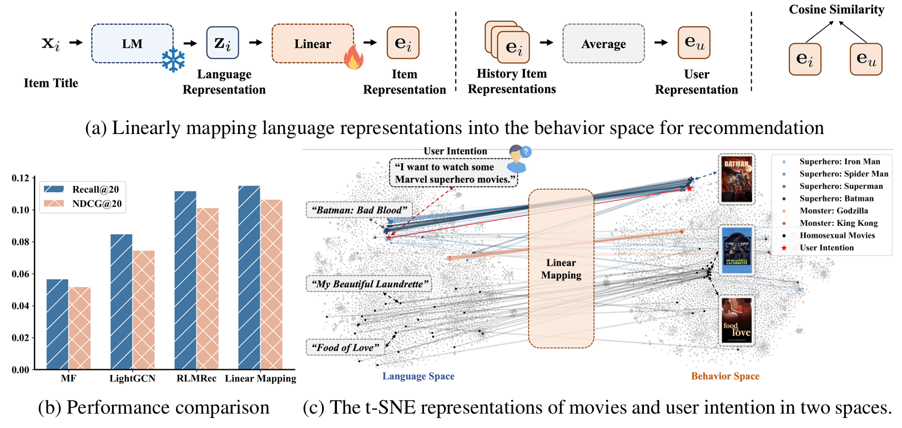
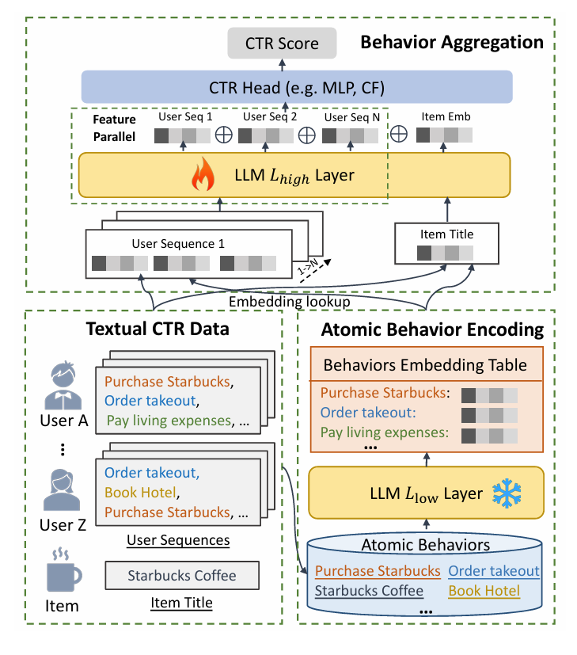

## PAD

**Motivation：**
- 冷启动问题
- 高推理延迟
- 对齐损失使用非特征核，非特征核不能捕捉数据分布的全部统计信息
- 将文本嵌入对齐到协作空间会导致遗忘

**Method：**
PAD框架：
使用预训练的大模型和推荐模型获得嵌入
通过 MK-MMD 对齐，特征对齐损失结合 BCE 损失，分别解决捕捉数据分布和遗忘问题，只对齐会导致 ID emb 在空间中偏离原本分布太大？保留推荐信息，防止遗忘
三专家监督微调，每个模态两个表，隔离开信息防止更新导致遗忘，保证对齐的信息文本的信息ID的信息都使用。gating 针对不同频率的物品，采用不同的比例，解决冷启动问题。

**Inspiration：**
- 冻结和更新
- 对齐造成遗忘

## Molar

Molar: Multimodal LLMs with Collaborative Filtering Alignment for Enhanced Sequential Recommendation

MLLM + CF 多模态信息整合再加上协同过滤信息

**Motivation：**
- LLM 缺少协同过滤信息；依赖文本模态，忽略多模态内容
- MLLM 多模态整合问题：非文本信息丢失或者多模态特征没对齐
- 过早融合 ID 导致协同过滤信息丢失，可能学了个 ID 规律，根本没学到什么信息

**Method：**
Molar 框架：
1. **Multimodal Item Representation Model (MIRM)**：
   MLLM 提取物品的多模态嵌入
   - 图像-文本对齐微调，图像生成文本描述
   - Structured Attribute 输入物品属性，输出文本描述
   - Temporal User Behavior Understanding，这个应该相当于直接利用大模型理解用户行为预测

2. **Dynamic User Embedding Generator (DUEG)**：
   - 基于LLM（去除词嵌入层）处理物品嵌入序列
   - 生成动态用户嵌入
   - 损失：Point-wise BCE + Alignment Loss（对比学习对齐 ID 和 content 用户嵌入），其中 ID 用户嵌入有协同过滤信息

后对齐 ID 和内容模型的用户嵌入

## LLM-ESR

LLM-ESR: Large Language Models Enhancement for Long-tailed Sequential Recommendation

解决长尾问题，协同信息少，利用语义信息增强

**Motivation：**
- 长尾用户长尾物品
- **现有方法问题**：
  - LLM 高推理延迟
  - LLM 嵌入不冻结就微调会丢失原始语义关系
  - 只关注物品侧，忽略用户侧的语义增强

编码大模型的提示文本，获取物品和用户的语义嵌入

**Method：**

LLM-ESR框架包含两个核心模块：

1. **Dual-view Modeling（双视图建模）**：
   - **语义视图（Semantic-view）**：
     - 使用LLM提取物品的语义嵌入，通过prompt组织物品属性和描述
     - **冻结LLM嵌入**，避免微调丢失语义关系
     - adapter 维度适配空间变换到推荐空间，得到物品嵌入
     - 将物品嵌入序列输入序列编码器，得到语义视图的用户偏好表示
   
   - **协作视图（Collaborative-view）**：
     - 使用可更新的协作嵌入层编码物品
     - 通过序列编码器得到协作视图的用户表示
     - **初始化**：用 PCA 降维后的 E *~se~*  初始化 E *~co~* ，因为语义视图是预训练的，协作视图是从头训练的，解决两个视图训练不平衡问题
     - 交叉注意力机制，让两个视图的序列相互交互
     - 预测时拼接两个视图的用户和物品嵌入

2. **Retrieval Augmented Self-Distillation（检索增强自蒸馏）**：
   - **检索相似用户**：
     - 使用 LLM 提取用户偏好表示，将用户交互的物品标题组织成 prompt
     - 通过余弦相似度检索 Top-N 相似用户
   
   - **自蒸馏进行迁移**：
     - Teacher：相似用户的用户表示均值，知道信号
     - Student：目标用户的用户表示

**与PAD和Molar的对比：**
- **PAD**：关注对齐和遗忘问题，使用MK-MMD和BCE损失，三专家架构
- **Molar**：关注多模态整合，MLLM提取物品嵌入，后对齐ID和内容嵌入
- **LLM-ESR**：关注长尾问题，双视图融合语义和协作信息，检索增强自蒸馏
- **共同点**：都利用LLM的语义能力，都避免实时LLM推理，都关注冻结/更新策略

## AlphaRec

Language Representations Can be What Recommenders Need: Findings and Potentials

发现语言表示空间中隐式编码了协作信号，提出完全基于语言表示的推荐模型

**Motivation：**

语言模型是否隐式编码了用户偏好信息（协作信号）？
LMs通过大规模文本预训练，学习了世界知识；物品标题、描述等文本可能隐含用户偏好信息
普遍认为 LMs 和传统推荐器学习两个不同的表示空间（语言空间 vs 行为空间），需要对齐才能增强。实际可能直接从语言表示空间提取推荐空间，同态关系。

Linear Mapping 实验发现，语言表示中编码了协作信号，语言表示空间和推荐空间之间存在同态映射

**Method**

完全基于语言表示，不使用 ID 嵌入的 CF 模型

1. **MLP**：非线性变换有助于从语言表示空间中挖掘出更全面的偏好相似性，用两层MLP替代线性映射矩阵

2. 图卷积

3. 对比学习

**完全不用ID嵌入？**
ID 嵌入缺乏语义，迁移能力差、无法感知用户意图，语言表示包含丰富语义，可以解决这些问题

## BAHE

Breaking the Length Barrier: LLM-Enhanced CTR Prediction in Long Textual User Behaviors

解决 LLM 在 CTR 预测中处理长文本用户行为序列的效率瓶颈

**Motivation：**
LLM处理长用户行为序列的效率瓶颈。CTR 预测中，整合更长、更丰富的用户序列通常能提升性能，但随着序列增长，LLM 的训练和推理效率显著下降，无法处理大规模CTR预测

- 相同行为在不同用户序列中被重复编码，例如用户i和j都包含行为a1、a2、a3，导致不必要的重复编码
- 行为表示提取和行为交互建模耦合。行为的语义是静态的，但用户序列顺序是动态的，现有方法将行为表示提取与序列理解绑定，频繁更新消耗计算资源

**Method：BAHE框架**

分层架构，解耦行为编码和行为交互，低层预训练，高层可训练

1. **原子行为编码**：
   - 使用 LLM 的**预训练低层**编码所有原子行为
   - 离线存储到行为嵌入表
   - 关键是从 token 级编码升级到行为级编码，序列长度从 token 数减少到行为数

2. **行为聚合**：
   - 从离线存储的行为嵌入表中检索用户序列中的行为嵌入，拼接得到序列表示
   - 使用 LLM 的**深层可训练层**建模行为间交互，得到用户序列表示

3. **Feature 并行**：并行独立处理每个用户序列，最后拼接

4. **CTR Modeling**：用户表示和物品表示拼接后输入 CTR 模型

**效率**
O(L(NMK)²)，序列数 × 行为数 × token数
O(L~low~(HK²)) + O(L~high~(NM²))

**分层架构**
- 解耦，复用
- 行为编码，缩短序列长度
- 异步更新

---
## LLM-CF（todo占位

Large Language Models Enhanced Collaborative Filtering

使用LLM的世界知识和推理能力增强协同过滤，通过in-context learning和chain of thought reasoning

**Motivation：**
- LLM-enhanced RSs 无法充分利用协同过滤信息：LLM只能接受有限数量的用户和物品作为输入
- 现有方法主要关注有限的用户-物品信息，忽略了协同过滤信息
- 效率问题：新交互或新物品出现时需要实时LLM处理，导致效率低下

**Method：**

LLM-CF框架分为两部分：

1. **离线服务**：
仅用推荐数据微调 LLM 会导致遗忘通用能力
使用混合数据方法（推荐数据 + 通用instruction-tuning数据）微调LLaMA2，训练得到RecGen-LLaMA，通用能力和推荐能力
生成 CoT Reasoning
使用 RecGen-LLaMA 为训练数据生成 CoT reasoning

1. **在线服务**：
   - **检索**：进行embedding-based检索，从In-context CoT数据集中检索Top-K相似历史推荐示例，检索到的示例包含相似推荐特征和CoT reasoning
   
   - **In-context Chain of Thought**：使用检索到的in-context CoT examples和当前推荐特征构建ICT tokens，使用Transformer Decoder层进行in-context learning，学习世界知识和推理引导的协同过滤特征 $\mathbf{w}_i$

**效率**
离线生成CoT reasoning，避免实时LLM推理
检索使用预计算embedding 搜索
解耦LLM生成和推荐系统在线服务

**Inspiration：**
- In-context learning和Chain of Thought reasoning的应用
- 混合数据微调平衡通用和推荐能力

**对比：**
- **PAD**：对齐文本和协作嵌入，使用MK-MMD，三专家架构
- **Molar**：MLLM提取多模态嵌入，后对齐ID和内容嵌入
- **LLM-ESR**：双视图融合语义和协作，检索增强自蒸馏
- **AlphaRec**：**完全不用ID嵌入**，纯语言表示，发现语言空间中的协作信号
- **BAHE**：**解决长序列效率问题**，分层架构，行为级编码，离线存储复用
- **LLM-CF**：**In-context CoT reasoning**，检索相似历史示例，通过ICT模块学习CF特征，离线/在线解耦
- **共同点**：避免实时LLM推理（预提取/离线存储）
- **区别**：
  - AlphaRec：纯语言表示可以超越ID-based CF
  - BAHE：效率优化，分层和复用
  - LLM-CF：使用in-context learning和CoT reasoning 增强协同过滤

