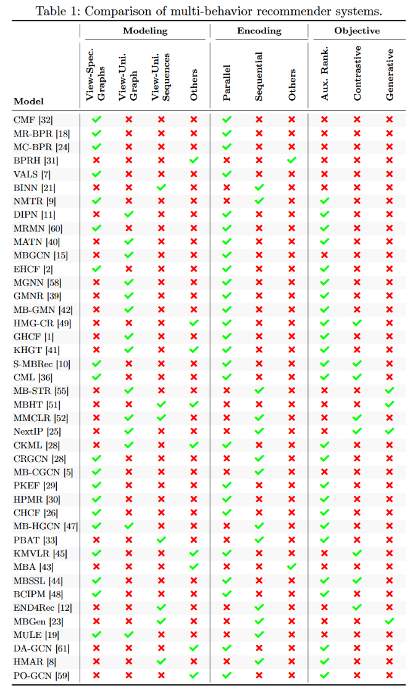
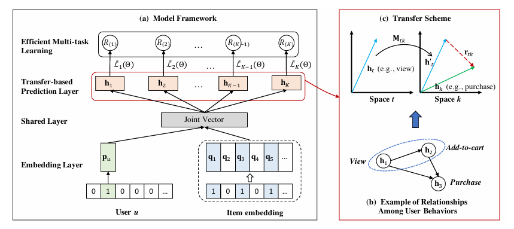
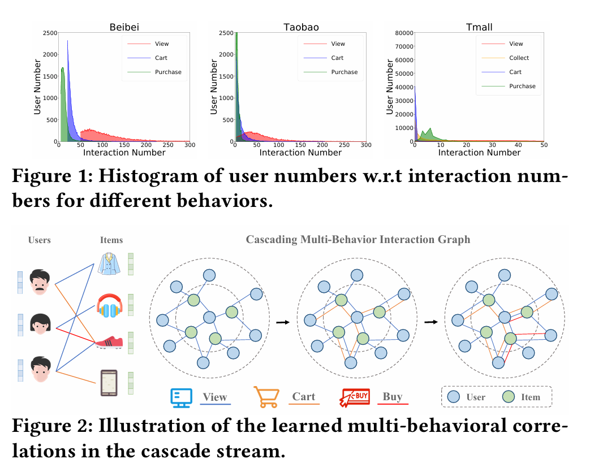
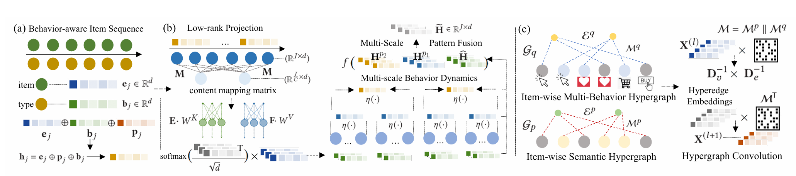
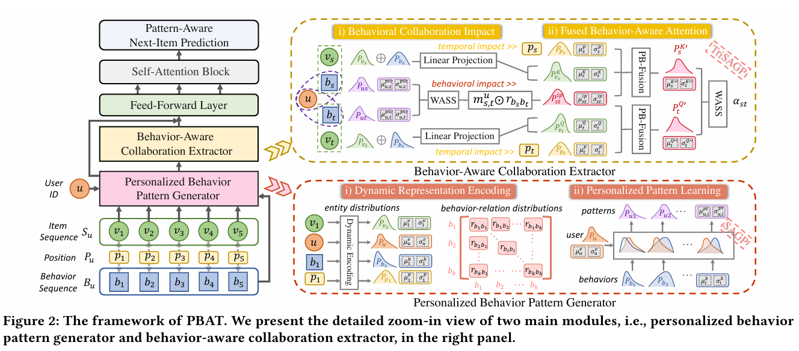
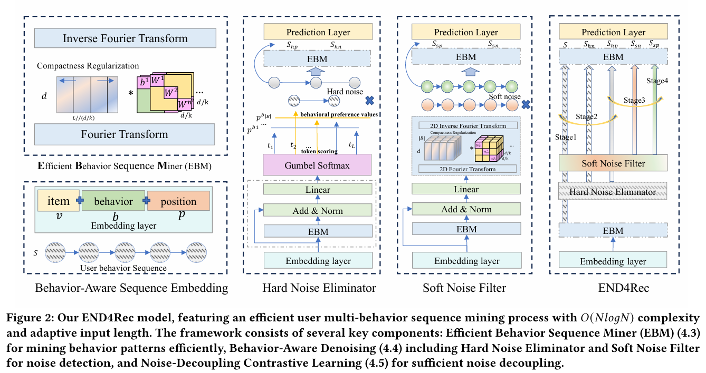
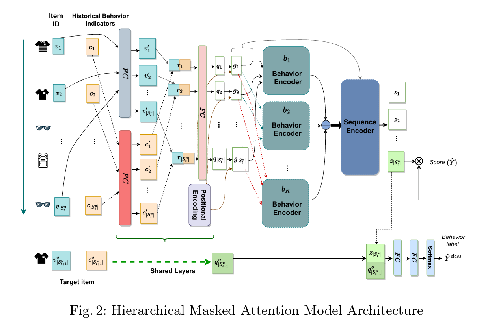

# Multi-Behavior Recommendation: A Survey

三个步骤：

1. 数据建模：输入层表示多行为，数据结构（如图或序列）来表示多行为交互，捕获多行为的独特特征或协同作用
   - View-Specific Graphs：对每种行为类型进行单独建模
   - View-Unified Graph：多种行为类型统一到一个图中
   - View-Unified Sequences：多种行为类型统一到一个序列中
2. 编码框架
   - 并行，分别或同时处理各个行为，捕捉行为特定的特征
   - 串行序列编码：捕捉动态依赖，行为演变
3. 训练目标：优化的流程，可由目标引导
   - 主要训练目标：提升推荐准确率，通常基于采样策略
   - 辅助训练目标：改善潜在特征的质量，通过辅助任务和自监督学习

数据建模：

1. 行为特定图：保持不同行为类型的独特特征
   1. 无序
   2. 有序
2. 行为统一图：不同用户行为的交互协同
   1. 考虑边类型
   2. 不考虑边类型
3. 行为统一序列：用户行为动态变化
4. 超图，有向无环图，知识图谱

编码：

1. 并行：
   1. 无序行为特定图：每个特定行为的图单独编码，确保每个行为的单独特征不受到其他行为干扰
   2. 考虑边类型行为统一图：
2. 串行/顺序：
   1. 有序行为特定图：
   2. 不考虑边类型行为统一图：
   3. 行为统一序列：

训练：

1. 主要训练目标：设计损失函数，区分正负样本，确保正样本分数高于负样本。
2. 辅助训练目标：
   1. 辅助排名预测：目标行为和辅助行为联合学习
   2. 对比学习：
   3. 生成式学习：训练推荐系统预测被屏蔽的项目或行为

## EHCF

[Efficient Heterogeneous Collaborative Filtering without Negative Sampling for Recommendation](http://www.thuir.cn/group/~mzhang/publications/AAAI2020-Chenchong.pdf)

使用多行为异构数据

**Motivation：**

负采样：从未标记的数据中，抽取一部分作为负采样，高效，但采样有偏

非采样，全量训练，复杂

迁移，关联每个行为的预测，捕捉不同行为之间的复杂关系

**Methods：**

- 输入用户以及该用户的所有项目交互

- 将第一步的embedding加入共享层，为了方便建模所有行为类型

- 一共有k个行为，为每个行为学习一个预测层h(k)。不同行为的预测层应该彼此相关，对行为的预测依赖对其先前行为的预测（捕捉转移）

- 负样本的损失等于总的损失减去正样本的损失，最后多任务学习

## PKEF

[[2308.04807\] Parallel Knowledge Enhancement based Framework for Multi-behavior Recommendation](https://arxiv.org/abs/2308.04807)

**Motivation：**

多行为推荐框架：融合，使用网络建模用户不同行为之间的相关性；然后预测，多任务学习联合优化

- 数据不平衡
- 负迁移问题：多任务训练任务性能受到其他任务负面影响

## MBHT

[Multi-Behavior Hypergraph-Enhanced Transformer for Sequential Recommendation](https://arxiv.org/abs/2207.05584) KDD22 

[GitHub](https://github.com/yuh-yang/MBHT-KDD22)

结合序列建模和图建模的优势：改进的多尺度低秩 Transformer 来捕捉用户在不同时间粒度下的短时行为序列模式，构建多行为超图来捕捉物品间全局的、复杂的跨行为依赖关系

**Motivation：**

- **动态行为转换**：用户兴趣随时间变化，且在不同时间尺度上表现不同
- **复杂的全局多行为依赖**：不同用户对不同行为的依赖模式不同，传统的二元关系难以建模高阶关系，有些人喜欢“先收藏再买”，有些人“直接买”

**Method：**

需要一个模型既能像 Transformer 那样处理时序动态，又能像超图那样处理复杂的高阶依赖

- 多尺度行为感知 Transformer
  - **低秩自注意力 (Low-Rank Self-Attention)**：通过矩阵分解近似原始注意力
  - **多尺度聚合**：在不同时间窗口上池化聚合特征，捕捉细粒度和粗粒度的序列模式，最后模式融合
- 全局多行为超图学习
  *   两种超图
      *   **语义超图**：基于物品内容的语义相似度连接超边
      *   **多行为超图**：基于用户对物品的多种交互行为连接物品
  *   **超图卷积**：在超图上进行消息传递，捕捉全局的长距离依赖
- Cross-View Aggregation：融合来自 Transformer 和超图的物品表征，用于最终预测

感觉超图的构建和多视图融合也会吃性能。。。

## PBAT（todo）

[Personalized Behavior-Aware Transformer for Multi-Behavior Sequential Recommendation](https://arxiv.org/abs/2402.14473) MM23

## END4Rec

FFT 提升效率，去噪

[END4Rec: Efficient Noise-Decoupling for Multi-Behavior Sequential Recommendation](https://arxiv.org/abs/2403.17603) WWWW24

**Motivation：**

*   **效率问题**：多行为让用户行为序列变得非常长。传统的 Attention 机制计算复杂度是 $O(N^2)$，处理长序列太慢。
*   **噪声问题**：多行为数据很脏。比如“误点击”（Hard Noise，离散的错误点）或者“过时的兴趣”（Soft Noise，连续的特征层面的噪声）。如果不加区分地全部学习，模型会被噪声误导

**Method：**

提出 **EBM (Efficient Behavior Sequence Miner)**：利用**傅里叶变换**将序列转换到频域进行处理，将计算复杂度降低到 **$O(N \log N)$**

双重去噪机制：

*   **Hard Noise Eliminator**：在 Token 级别直接剔除“误触”等无效交互
*   **Soft Noise Filter**：在特征层面（频域）滤除代表过时兴趣的频段

*   **去噪对比学习**：通过对比去噪后的序列和噪声序列，时模型学会区分什么是有用信息，什么是噪音

1. 行为感知序列嵌入 (Behavior-Aware Sequence Embedding)

   *   输入Item ($v$)，Behavior ($b$)，Position ($p$)

   *   将三个 Embedding 相加，得到初始的序列表示 $S$

2. 高效行为序列挖掘器 EBM (Efficient Behavior Sequence Miner)：替代了传统的 Transformer Attention 层
   1.  Fourier Transform：将时间序列特征 $S$ 转换到频域
   2.  Compactness Regularization：正则化
   3.  频域处理：使用了 Chunked Diagonal Mechanism (分块对角机制)，就是把大矩阵切成小块处理（图中的 $d/k$），减少参数量和计算量，然后通过矩阵乘法融合不同频率的信息
   4.  Inverse Fourier Transform：将处理好的特征从频域变回时域，得到输出。

3. 双重去噪模块 (中间两列)

   1. Hard Noise Eliminator：识别并剔除像“误点击”这样的离散噪声

      - 输入 $S$，EBM

      *   **Behavioral Preference Values**：根据行为类型赋予不同的权重

      *   **Token Scoring**：给序列中每个 Item 打分，判断它是不是噪声

      *   **Gumbel Softmax**：可微分的采样技巧，根据分数决定保留还是丢弃某个 Item

      *   **输出**：将原始序列 $S$ 分裂为两个
          *   **$S_{hp}$ (Hard Positive)**：保留的干净序列
          *   **$S_{hn}$ (Hard Negative)**：被剔除的噪声序列

   2. Soft Noise Filter：滤除特征层面的噪声（如兴趣漂移、不明显的干扰）

      *   输入 $S_{hp}$，复用 EBM

      *   过 2D Fourier Transform 进入频域，利用可学习的滤波器在频域中对特征进行提纯

      *   **输出**：
          *   **$S_{sp}$ (Soft Positive)**：最终提纯后的高质量特征序列
          *   **$S_{sn}$ (Soft Negative)**：滤出的软噪声特征

4. 整体训练流程 END4Rec：模型最终组装和训练策略

   *   **多阶段训练 (Stage 1 - Stage 4)**
       *   **Stage 1**: 先预训练 EBM 骨架。
       *   **Stage 2**: 训练 Hard Noise Eliminator，让模型学会由粗到细地扔掉噪声数据
       *   **Stage 3**: 训练 Soft Noise Filter，让模型学会精细化去噪（对比 $S_{sp}$ 和 $S_{sn}$）
       *   **Stage 4**: 联合微调整个模型

   *   堆 EBM 在 Soft Noise Filter 之后，又接了一个 EBM 层用于最终的特征编码，最后输出到 Prediction Layer 进行预测

## MBGen (todo)

Multi-behavior ==generative== recommendation CIKM24

## HMAR

分层掩码注意力机制

[HMAR: Hierarchical Masked Attention for Multi-Behaviour Recommendation](https://arxiv.org/abs/2405.09638) PAKDD24
[GitHub](https://github.com/Shereen-Elsayed/HMAR)

**Motivation：**

现有的模型虽然能处理多行为，但难以捕捉历史交互中的复杂序列模式
有些方法利用图结构，牺牲了时间序列的顺序信息，导致对用户演变兴趣的建模不足

**Method：**

结合序列推荐和多行为建模，通过分层的注意力机制，行为内部的逻辑 + 行为之间的逻辑

对同一行为的物品应用掩码自注意力，再对所有行为进行自注意力计算

- 物品和行为编码
  - 物品嵌入
  - 历史行为指示器 HBI：显式编码某个物品在序列中是第几次发生该特定行为，用于捕捉行为频率特征
  - 位置编码
- 分层掩码注意力
  - 第一层：行为编码器：使用掩码机制，针对每种特定行为，利用Self-Attention对同类行为的物品进行建模
  - 第二层：序列编码器：将第一层输出的所有行为的表征合并，使用Self-Attention对整个序列进行建模，捕捉不同行为之间的依赖关系
- 多任务学习
  - 主任务：预测下一个交互的物品，最后一个输出向量 ($z_{|S_t^u|}$) 与目标物品向量 ($q^o_{|S_{t+1}^u|}$) 进行点积
  - 辅助任务：预测下一次交互的行为类型，$z$ 和 $q^o$ 拼接，过两个全连接层和一个Softmax层
  - 损失函数：加权融合排序损失（Weighted Binary Cross-Entropy）和分类损失
