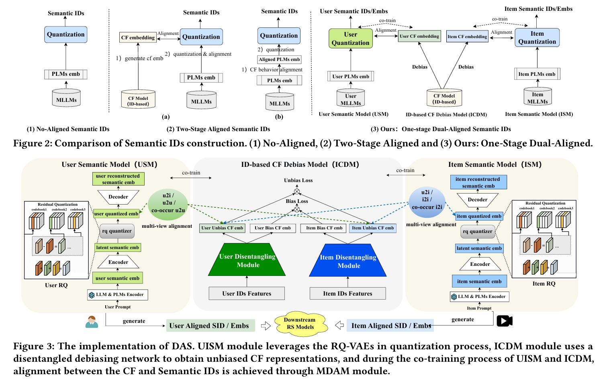
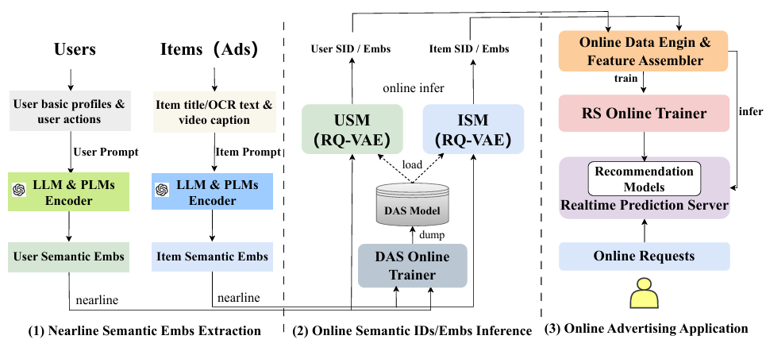
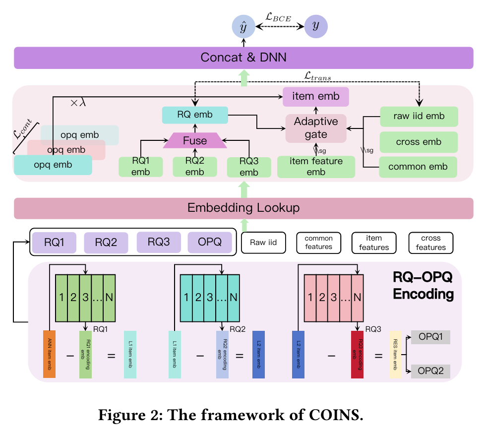

## DAS: Dual-Aligned Semantic IDs Empowered Industrial Recommender System

[[2508.10584\] DAS: Dual-Aligned Semantic IDs Empowered Industrial Recommender System](https://arxiv.org/abs/2508.10584)

**Motivation**：

传统 ID 缺乏语义，SID 缺少协同

两阶段方法（先量化生成 SID，再对比学习添加协同信号）效果不好

- 因此需要一个单阶段的方式：生成 SID 的同时，添加协同信号

**Method**：DAS (Dual-Aligned Semantic IDs) 

- **多视角对比对齐 (Multi-view Contrastive Alignment)** 把协同信号注入语义ID

1. **ID-based CF Debias (去偏协同信号)**
   - 直接使用点击数据训练会有流行度偏差（从众兴趣和无偏兴趣），DAS 首先训练一个去偏的辅助CF模块，提取出纯净的用户兴趣信号，而不是简单的热门物品信号
2. **多视角对齐损失**：
   - **Dual u2i**
   - **Dual i2i / u2u**：这些对齐就是SID和去偏
   - **Co-occur i2i / u2u**：利用共现关系（Co-occurrence），让经常一起出现的物品或相似用户在语义空间中也保持距离相近

- **双重学习 (Dual Learning)**：用户侧和物品侧都生成SID

1. LLM生成用户和物品的语义emb
2. 量化用户和物品的语义emb，生成语义ID

**INSPIRATION**：

对多模态表示进行对齐和融合，构建出可用于下游任务的固定特征嵌入

将多模态表示离散化成语义 ID 作为特征输入到模型中

## COINS: SemantiC Ids Enhanced COLd Item RepresentatioN for Click-through Rate Prediction in E-commerce Search

[[2510.12604\] COINS: SemantiC Ids Enhanced COLd Item RepresentatioN for Click-through Rate Prediction in E-commerce Search](https://arxiv.org/abs/2510.12604)

**Motivation**：

传统 ID 冷启动问题

SID 缺少与推荐任务的对齐

**Method**：

从下往上：RQ-OPQ 编码，嵌入查询，特征融合与门控，预测

1. RQ-OPQ Encoding

   包括 RQ 和 OPQ，两步量化得到 SID

   1. RQ：残差量化
   2. OPQ (Optimized Product Quantization) : 

2. Embedding Lookup

   同时查询 SID 和原始特征的嵌入，SID 能够利用语义信息解决冷启动问题

3. Fusion and Adaptive Gate

   也是处理冷启动

   1. 融合不同层级的语义编码（RQ1, 2, 3 emb）生成 RQ emb

   2. 门控就是控制去侧重使用 SID 和 物品特征的 emb 还是侧重使用原始物品 ID

   3. 知识迁移：迁移损失让语义嵌入 RQ emb 逼近充分训练的热商品 ID

4. Concat & DNN

   拼接嵌入，进 DNN 预测点击率

**Inspiration**：

门控，融合 SID emb，特征 emb 和传统 ID emb

## Q-BERT4Rec: Quantized Semantic-ID Representation Learning for Multimodal Recommendation

[[2512.02474\] Q-BERT4Rec: Quantized Semantic-ID Representation Learning for Multimodal Recommendation](https://arxiv.org/abs/2512.02474)

