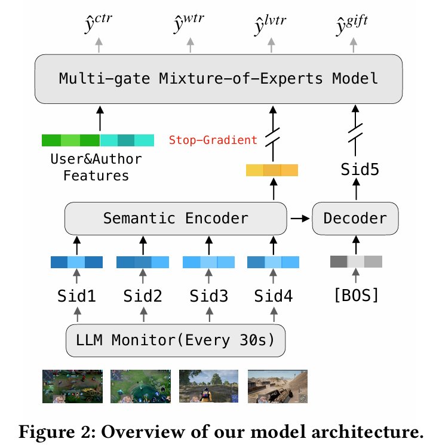
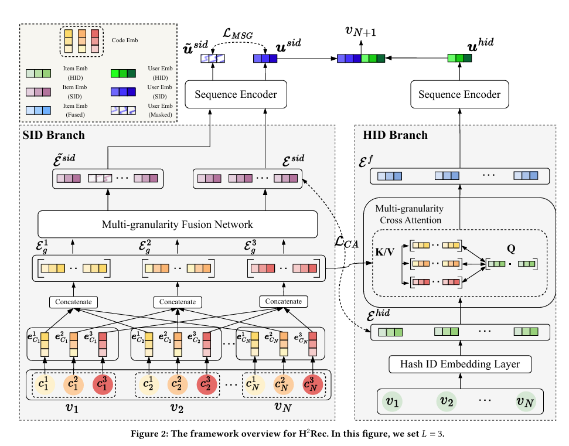

## Foresight Prediction Enhanced Live-Streaming Recommendation

**Motivation:**

传统推荐在直播上不适用，直播内容实时变化，有highlight moments，需要在最佳时刻推给观众，需要预测直播内容

**Method**：

Senmntic Quntization语义量化：

- 用多模态LLM对直播切片理解
- SID，因为LLM的emb太大，用K-Means构架码本，其实就是直播切片进LLM最后聚类成SID，直播流变成SID序列，然后就有点像做nlp任务

Foresight Prediction预测

- encoder处理sid序列，decoder预测未来的sid，encoder的输出和decoder的输出融合做增强特征
- 多任务，做点击，观看时长等

停止梯度应该是让预测模型和推荐模型分开，预测下一个Sid和推荐模型预测CTR/GTR，将预测出的sid作为一种特征输入到MMOE中

## The Best of the Two Worlds: Harmonizing Semantic and Hash IDs for Sequential Recommendation

**Motivation:**

- HashID，编码唯一，有长尾问题，语义理解对长尾问题有很好的解决，所以用SID应该效果会好
- SID，VQ量化，也有缺点，量化压缩导致了不同的物品可能有共同的SID

**Method**：

- Dual-branch双分支
- SID分支物品的文本通过LLM再RQ-VAE 量化得到多层离散Code，Multi-granularity Fusion Network根据用户的当前兴趣，动态决定关注哪一层粒度的语义
- HID分支输入IDemb，Multi-granularity Cross Attention。Query: 使用唯一的HID，Key和Value: 使用SID，让HID去查询它需要的语义补充信息
- 让 HID 和 SID 的向量空间对齐，掩码掉某些层级的语义，强迫模型利用剩余的上下文去还原