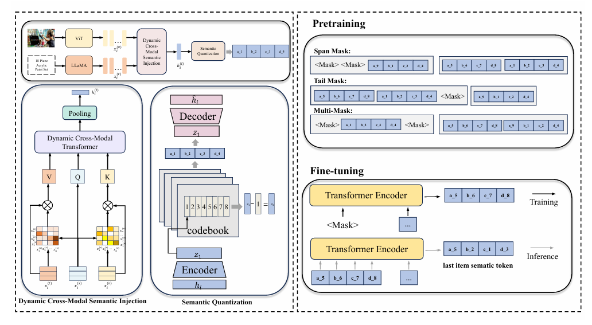
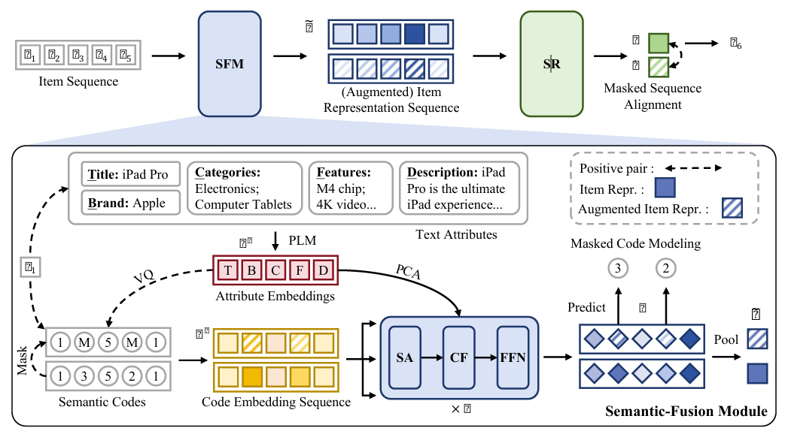
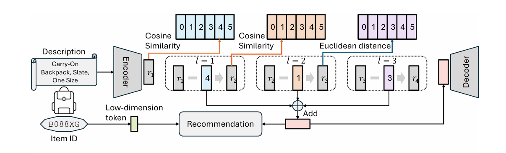

## Q-BERT4Rec: Quantized Semantic-ID Representation Learning for Multimodal Recommendation

多模态结合 SemanticID

**Motivation：**

多模态

**Method：**

左上角ViT和LLaMA图像和文字编码，通过一个Dynamic Cross-Modal Semantic Injection把图片和文字信息融合，量化获得sid

## Bridging Textual-Collaborative Gap through Semantic Codes for Sequential Recommendation

**Motivation：**

很多推荐系统会根据商家写的描述来生成id，但商家写的和用户实际买的可能对不上号 。这种文字描述和用户实际购买行为之间的差距Textual-Collaborative Gap，所以用sid作为桥梁，把商品长啥样和是怎么买它的这两件事统一起来，让标签更贴合用户的真实心思

## Unified Semantic and ID Representation Learning for Deep Recommenders

**Motivation：**

传统的id虽然没意义，但在区分细微差别时很好用；而sid虽然有语义，但语义有时候分不清两件很像的物品。所以把两种标签合二为一

