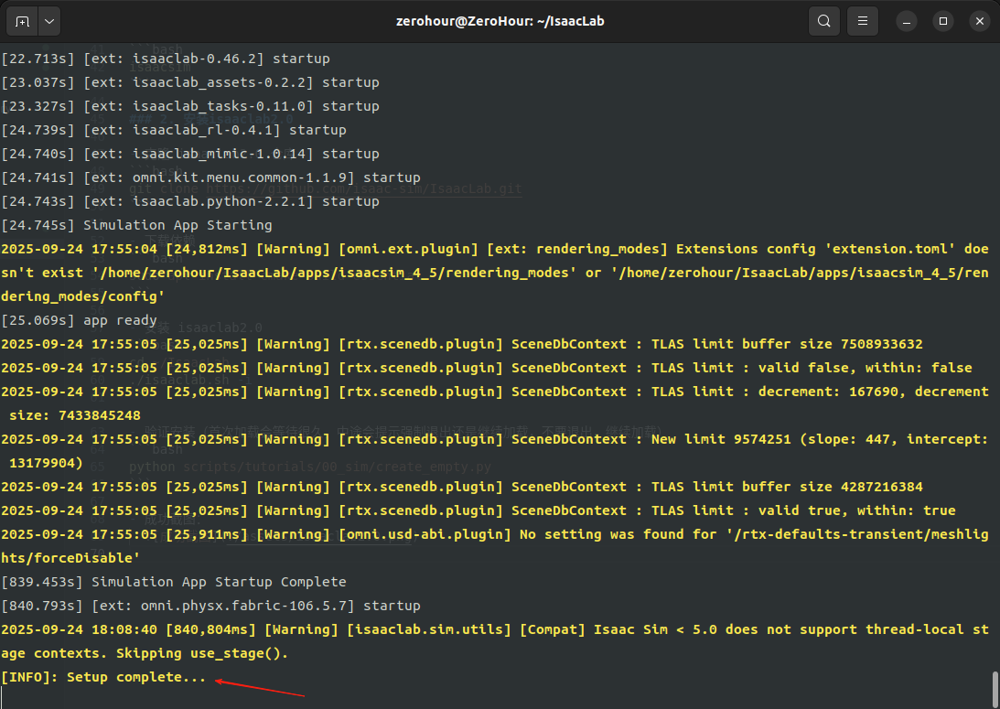
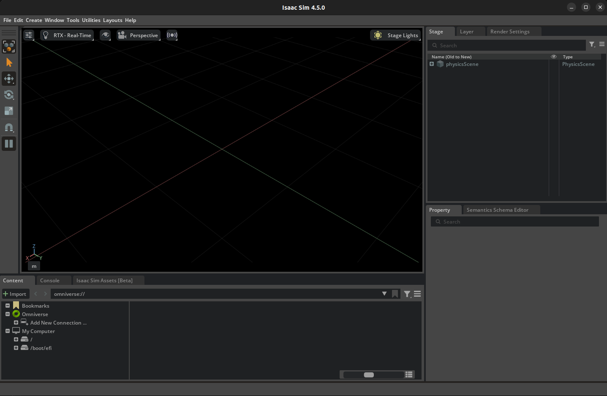

## 安装 Isaac Sim 4.5

官网提供了两种安装方式，一种是使用 pip 安装，一种是使用给的 zip 压缩包安装。
我是用 pip 在 conda 环境里安装的，conda 的命令可以参考[Miniconda 常用命令速查](https://zerohour.fun/blog/daily/241102/)。

- 创建一个名为 env_isaaclab 的 conda 环境，并安装 python3.10。
```bash
conda create -n env_isaaclab python=3.10
```

- 激活环境
```bash
conda activate env_isaaclab
```

- 安装 torch
```bash
pip install torch==2.5.1 --index-url https://download.pytorch.org/whl/cu118
```

- 下载 isaacsim4.5
```bash
# 升级 pip
pip install --upgrade pip
# 安装 isaacsim4.5，指定安装 all 和 extscache 两个扩展，并且指定安装源为 nvidia 的 pypi 源
pip install 'isaacsim[all,extscache]==4.5.0' --extra-index-url https://pypi.nvidia.com
```

- 验证安装（首次加载会等待很久，中途会提示强制退出还是继续加载，不要退出，继续加载）
```bash
isaacsim
```

## 安装 Isaac Lab 2.0

- 克隆 isaaclab2.0 仓库
```bash
git clone https://github.com/isaac-sim/IsaacLab.git
```

- 下载依赖 
```bash
sudo apt install cmake build-essential
```

- 安装 isaaclab2.0
```bash
cd ~/IsaacLab
./isaaclab.sh -i
```

- 验证安装（首次加载会等待很久，中途会提示强制退出还是继续加载，不要退出，继续加载）
```bash
python scripts/tutorials/00_sim/create_empty.py
```

- 加载成功命令行会显示 **Setup complete...**
  
  
  成功截图

  